# 完美的Trime（同文）单手九宫格双拼方案flypy932.schema

我是用小鹤音形，目前在尝试米旮旯3
同文输入法里的九宫格皮肤太少了，所以在这里备份整理自己的Trime/同文 方案库

> 我的同问输入法是3.3.7版本

一、**为什么还在坚持九宫格？**
在如今这个全键盘横行的时代，九宫格输入法似乎已经成为了”过时”的代名词。但是，对于很多老用户来说，**九宫格依然有着不可替代的优势：单手操作便捷、按键准确率高、适合大屏手机盲打…**

**我的体会是：单手打字一定是九宫格最方便**！

然而，现实是残酷的。随着RIME输入法在手机端的用户群体逐渐小众，特别是九宫格布局相关的资源更是凤毛麟角。网上能找到的九宫格方案不少，但配套的布局文件却寥寥无几，这导致很多方案无法正常使用，真是让人哭笑不得。

二、为什么RIME九宫格资源这么少？
经过深入调研，我发现几个原因：

1. **用户群体变化**：**年轻用户更习惯全键盘，九宫格用户逐渐减少**。2. **维护成本高**：九宫格方案需要同时维护拼音映射和按键布局，复杂度更高。3. **开发者流失**：像四叶草这样的优秀项目停止维护，社区活跃度下降。4. **商业输入法垄断**：搜狗、百度等商业输入法占据了大部分市场

三、开源的意义

正是因为资源稀缺，我才决定整理并开源这个库。希望：
1. **保存经典**：让优秀的九宫格方案不至于消失。2. **降低门槛**：提供开箱即用的配置，让更多人能体验九宫格。3. **社区贡献**：抛砖引玉，希望有更多开发者参与进来

虽然RIME和九宫格可能不再是主流，但总有一群人喜欢这种经典的输入方式。如果你也是九宫格爱好者，或者对RIME输入法感兴趣，欢迎来试试我的配置。

--- 

## 2025年12月06日更新 flypy932.schema
在使用的过程中，发现**词库的影响很大**，用好的词库明显比用四叶草的词库，打出来的候选准确很多！！
所以重新调整了方案，删除了四叶草方案，改用**万象拼音**的词库，并且加上了他的所谓的模型`wanxiang-lts-zh-hans.gram`。

🚩🚩**经验总结：换词库=换体验**。

🚩🚩如果你是从大厂全拼九宫格输入法来的，并且像我一样也尝试了百度的九宫格方案，如米旮旯3，在不考虑按键不熟悉的问题情况下，当时我仍然觉得候选字和自己想要的差太远了，一开始总认为是方案不好，这次只换了词库，发现打出的字绝大多数时候都符合心意，才发现原来词库的影响是巨大的，**因此一定要保证上手九宫格双拼方案的时候直接使用自己导出的词库**，要不会很容易受挫。

继续：

米旮旯3仍然发现有很多重码的地方，而且如果用同文九宫格的话，根本无法挑选拼音，**几乎相当于同文是不支持九宫格的**（即官方不支持九宫格！），导致同文的九宫格**几乎宣告死亡**。

但是在知乎上看到了一个帖子，九宫格双拼的无重码排布，通过“击键三次”实现准确的拼音输入，“击键三次”的无重码排布方案节奏感强，富有规律性。兼容市面上主流的双拼输入。[九宫格双拼的无重码排布](https://zhuanlan.zhihu.com/p/107201990) https://zhuanlan.zhihu.com/p/107201990

在 [大佬 Ennuyeux233](https://github.com/Ennuyeux233/rime_abc_932) 的技术支持下，分享给了我小鹤双拼932方案
项目中**flypy932.schema** 以及对应的 flypy932九宫格32拼.trime 手机皮肤
> rime_abc.schema是大佬自己的智能abc的双拼方案

在尝试了一个星期之后，我认为这个方案对于**小鹤用户非常的方便**，没有使用难度（**方案进行小修后，可以适用于任何双拼！**）。布局是这样的：

|     |     |     |
| --- | --- | --- |
| qw  | adc | def |
| ghi | jkl | mno |
| prs | tuv | xyz |

### 单字模式

1、比如我想输入“dan”这个拼音，小鹤的搭配为dj，那么我们的第一键击3号键，第二键击5号键，d为3号键从左到右第一个字母，j为5号键从左到右第一个字母，那么就将其定为第一排第一个，即第三键击1号键，即告诉输入法我前面两击想要的是第一键的第一个字母和第二键的第一个字母组合的拼音，所以最后击键为3、5、1；

2、比如我想输入“su”这个拼音，小鹤的搭配为su，那么我们的第一键击7号键，第二键击8号键，s为7号键从左到右第三个字母，u为8号键从左到右第二个字母，那么就将其定为第三排第第二个，即8号键，所以击键为7、8、8；

3、比如我想输入“zhuang”这个拼音，小鹤的搭配是vl，那么我们的第一键击8号键，第二键击5号键，v为8号键从左到右第三个字母，l为5号键从左到右第三个字母，那么就将其定为第三排第三个，即9号键，所以击键为8、5、9。

### 日常使用32混输更丝滑

flypy932.schema方案是**2击和3击混合输入**，只有偶尔在需要的时候进行3击，得到**确定的拼音**即可，就**绕过了同文无法在九宫格状态筛选拼音的局限！**

添加**万象拼音**词库后，我发现日常打字**80%不需要用到3键**，只要2键就行，但是要有意识的打最常见的一些词组，或者你输入的多的3-5字的短语。所以在保持**双拼节奏感和少击键**的同时，完全能胜任日常打字聊天需要。

**即使候选不对，通过第3击操作，也可以很方便的进行候选**：
> 同文输入法设置里一定要把 `虚拟键盘-悬浮窗编码区使用插入符号(^)`打开，这样才能让我们定位修改。
> 同文输入法设置里一定要把 `在程序中显示撰写文本` 设置为 `预编辑码`。

1、打两字词语的时候，如果不是自己想要的候选，可以**立马跟后一个字的第3码**，很多时候就可以得到目标候选了
比如说打字`预习`，我先打`yuxi`，是`9894`，发现候选栏里完全没有我想要的`预习`


那就后面再打一个3键（`xi`的单字模式是`943`），就大概率能把`预习`顶到**第1排候选**里。

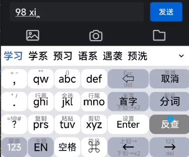

如果还不行，那就需要用键盘上的移动按钮对候选进行修改了，我设置了移动到首字、末字（首字按钮上划）、右移两下（首字按钮下划），单纯左移一下，右移一下，等相关按钮（因为我是单手，键盘上有很多多余的按钮用不到，所以设置这么多操作方式，哈哈）

**同文的左移是很智能的**，它能直接移动到前一个候选词的后面，我按一下"首字"（2排4位）或者"左移一下"（4排5位）按钮，都能跳转到`xt`(编码：98)后面，这时候我直接选定候选`学`字，光标会自动跳回到`xi`后面了：

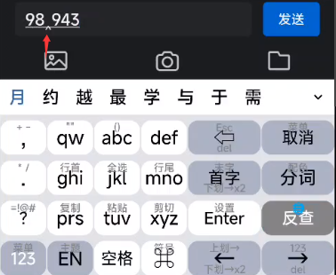

点击上图的`学`后，不过这个功能在打陌生短句的时候不一定是个方便的功能：
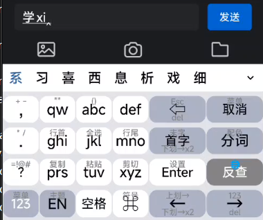

比如打字`纳米传承`，现在是这样，完全没有想要的：
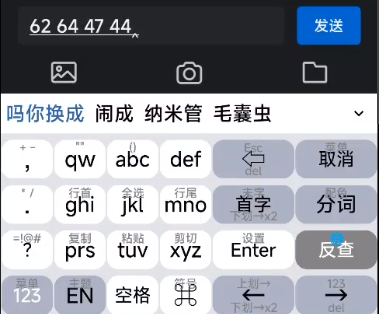

按`首字`按钮->按4（na：624）->确定`纳`为候选，候选`纳`：
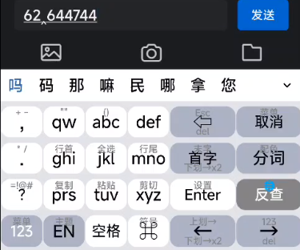

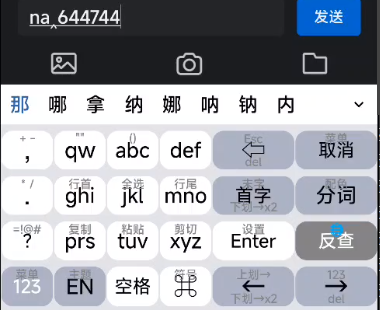

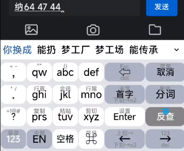

这时候光标跳回到了整个编码区末尾了，只能再按一下`首字`按钮回到第2个编码后面：

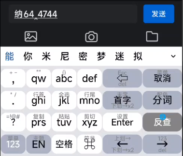

这样其实就麻烦了一点点，不过还好。大家看出来了吗，**由于2码3码混输，有时候会存在编码区混乱的情况，需要自己对自己的输入心中有数。**

用以上这种方式进行拼音的候选，我认为只是换了一种选拼音的方式，熟悉之后我觉得是比常规方式能减轻眼睛的负担的。

### 新功能开发思考

如果能增强功能，利用引导符号，比如 `ˋ`号，"6265ˋ43"来确定"nami"的拼音，要是能用lua实现这样的功能就好了。

### 其他功能：打字统计和计算器
#### 词条固定
在`flypy932.fixed.txt`添加：
```
2	的	打
```
效果如下：

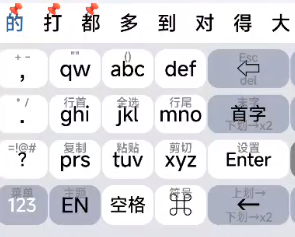

#### 小鹤音形辅助码辅助

我把全码表`flypydzfor932.dict.yaml`做了一点修改添加进了词库，放在了最后面

这样，通过`/`（同?键），就可以进行全码单打，比如 `时 uioc 84/62` 可以出来这个，将就着偶尔用用：

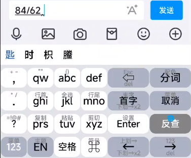

#### 中文模式下 `/` 引导统计功能

```
使用提示（例如/01 /rtj 两种方式均可）：
/01 /rtj	 查看日统计
/02 /ztj	 查看周统计
/03 /ytj	 查看月统计
/04 /ntj	 查看年统计
/05 /sztj		 查看生字/词
/008 /qcsz	清除生字/词
/009 /qctj	 清除所有统计数据

# 结果展示：
※ 日统计：
──────────────
上屏 792 次
输入 1135 字
最大分速 114.0 字
平均分速 65.3 字
平均码长 2.5〔含空格〕
──────────────
单字占比：41.3％
2字词占比：53.9％
>2字词占比：4.8％
──────────────
5码占比：39.6％
3码占比：25.8％
2码占比：25.1％
其它占比：9.5％
```

#### 中文模式下 `=` 引导计算器功能

## 使用方法：

1. 将仓库里除了`vx_images`、`百度输入法米旮旯3极简白助记`、`智能abc九宫格双拼932和米旮旯3方案`这3个文件夹外，其他文件和文件夹都放进trime用户目录下。（仓库：`https://github.com/AlexShyXie/myTRIME-migala3-Layout`）

2. 万象模型`wanxiang-lts-zh-hans.gram`下载，找到下载链接，下载后放入trime用户目录根目录下：[https://cnb.cool/amzxyz/rime-wanxiang/-/releases](https://cnb.cool/amzxyz/rime-wanxiang/-/releases)

3. 从你以前用的搜狗或者百度输入法里导出用户词库（百度输入法的Windows版：5.5.5063 安卓手机版：10.12.2.0，这两个版本可以导出词库），然后用深蓝转换器转换成`rime中州韵`格式：[https://github.com/studyzy/imewlconverter](https://github.com/studyzy/imewlconverter)

4. 用万象拼音的词库转换器（wanxiang-dicts-tools.exe），将深蓝转换器得到的`rime中州韵`格式文件，进行音调标注，这样才是标准的万象词库：[https://github.com/amzxyz/RIME-LMDG/releases](https://github.com/amzxyz/RIME-LMDG/releases)

5. 重新部署，启用`小鹤双拼九宫格`方案，使用`flypy32拼`主题

### 米旮旯3方案
migala3.schema.yaml是方案；主题就和flypy932.schema同一个Trime/同文的键盘皮肤九宫格主题就行。

我使用的是单手模式，九宫格在整个屏幕的左侧。

然后也添加了助记，所谓助记，就是在按钮上添加 `hint` （label下方）和 `label_symbol`（label上方） 。

我尝试了一个星期的米旮旯，先是使用同文输入法，发现根本无法选拼音，导致完全无法使用。

就转向百度输入法，这时候我发现重码仍然很严重，主要的问题是有些时候打一个词组出来，然后选拼音都要划两下才能翻到想要的拼音，非常的影响效率，让人感觉无法使用。

所以我放弃了米旮旯，但是仍然把相关的文件放这里，也许以后会有什么好方案也说不定呢。

### 小鹤音形flypy.schema添加权重

flypydz.dict.yaml和flypy.primary.weighted.dict.yaml都添加第3列的权重，单字权重4，到4个以上就为1，这样就可以在打字和反查的时候把单字放在候选最前面。

现在这样和官方小鹤多多版10.9q_20240326 build 423几乎没有区别。

-----

## 下面是第1版的展示（2025年11月18日）：

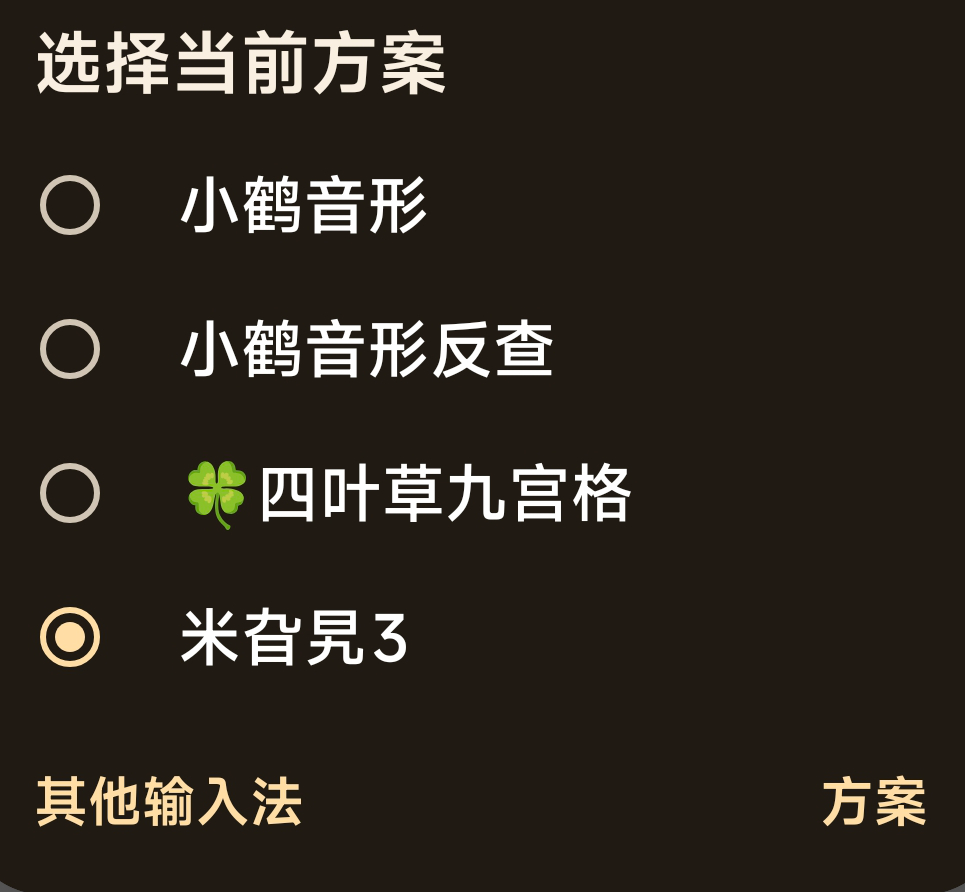

### 小鹤音形和反查都是用26键盘
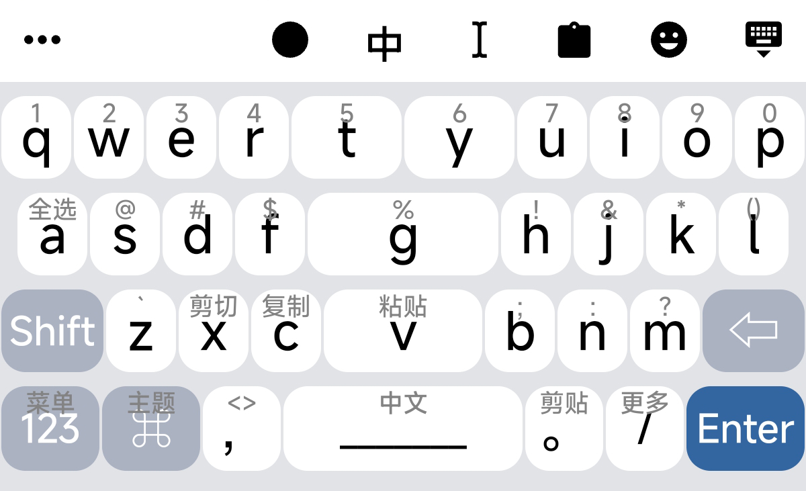

### 四叶草九宫格和米旮旯3通用九宫格主题皮肤
所谓九宫格皮肤，其实就是输入数字键，然后方案在后台进行分析，依据输入的数字来判定组合拼音

也就是说，你方案选择四叶草九宫格和米旮旯3，在26键的主题皮肤下按最上面的数字键，都能正常打出拼音。

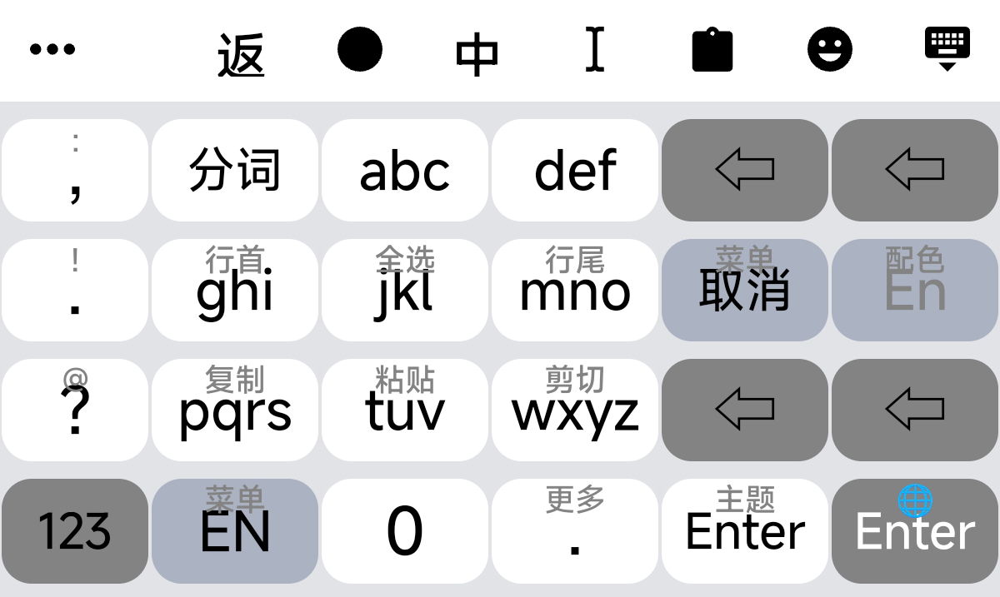

### 米旮旯3助记
百度输入法米旮旯3极简白助记

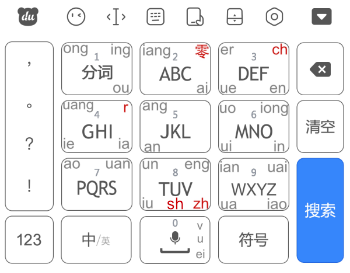


